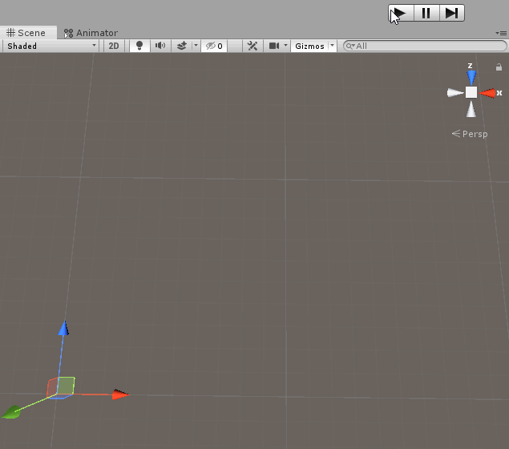

# Movement (A.K.A. Pajama Man Wandering a Maze With a Rifle)
Developer
: Durga Sivamani

Composer / Sound Designer
: Jake Kargl

I recently attended a game jam and met an awesome sound designer and composer (who just happens to be a grad student like me). We teamed up with some other devs, and while the game we made at the jam didn't really pan out, we decided to make a game ourselves. I am basically in charge of everything except sound, so it's heavy development.

>This is my current progress:

As you can see, this game is still a-cookin' and needs a lot of work to become a polished product. Although I would love to take credit for the amazing player character model and animations, they are actually from Unity 3D's free [Survival Shooter tutorial](https://learn.unity.com/project/survival-shooter-tutorial) asset package. 

*Expect to see lots of changes upon new visits to this page!*
   
## Game Features
There are several features I've been wanting to implement using solid software design and architecture [1](fn1). See below for details on what I've already implemented / will be implementing soon.

### Procedural Maze Creation
I designed a series of scripts (under the "Level Generation" folder) that design a new maze every time a level is created. There are some exposed options like *Tile Size*, *Border Thickness*, *Maze Height*, and *Maze Width* that allow developers to specify general properties about the maze using the Unity Editor [2](fn2).

The scripts work as follows:
1. The **LevelGenerator** in the scene creates a new **Maze** object with the specified parameters above.
2. The **Maze** object creates a 2D array of **AbstractTile** objects (instantiated as **FloorTile**, **WallTile** and **EmptyTile**).
3. The script traverses the array and populates cells, i.e., **WallTile** objects along the edge of the maze according to *Border Thickness*, **FloorTile** objects in a basic grid pattern according to the *Maze Height* and *Maze Width*. Everything else is an **EmptyTile**.
4. Then the script uses a recursive minimum spanning tree algorithm to traverse the **FloorTile** objects like a graph [3](fn3) and make a walkable path through the maze. Random **FloorTile** objects are created in between the paths to create loops in the maze (for added playing difficulty).
5. Finally, every **EmptyTile** object is converted to a **WallTile** to create divisions and complete the maze.

>See this in action! Every time the scene loads (here I'm doing it manually), a new maze is created!

### Mesh Generation
This works in conjunction with the procedural maze generation outlined above. Each time a maze is created, the meshes for each portion of the maze (floor, border walls, internal walls) are created by manually setting vertices, triangles, UVs and normals. This was a painstaking process to get right, and required a lot of conditional checking to ensure meshes weren't being made when you wouldn't see them (ex: in between walls).

Materials for each distinct mesh are set as options above, and sent through the **LevelGenerator** to the **Maze** object upon instantiation.

### Multiplayer Options
I am planning on creating a playable PvP option where players can compete against one another to see who can find their way out of the maze first. I haven't done this before, so I'm curious to see Unity's support for multiplayer systems.

### Everything Else
Like I said above... this game's still a-cookin'! Lots more features will be coming soon, like intelligent enemy AI, portals to leave the maze, keys to open the portals, and more.

#### Footnotes
---
*Written with [StackEdit](https://stackedit.io/).*

<a name="fn1">1.</a> I'm going through this book, [Game Programming Patterns](https://gameprogrammingpatterns.com/) by Robert Nystrom, and it's changing my game programming life.

<a name="fn2">2.</a> These can also be accessed and set programmatically in code.

<a name="fn3">3.</a> I say "like a graph" because I am not adhering to a strict graph data structure in this project. The tiles are stored in a 2D array, so even though they have a Dictionary collection of their neighboring tiles and relative positions, this is not what I am solely depending on to construct the maze.