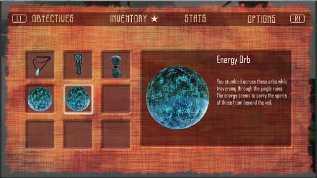

---

---

<h1 id="samsara">Samsara</h1>
<dl>
<dt>Developers</dt>
<dd>

Durga Sivamani 
<em>Team Lead, <abbr title="User Interface">UI</abbr> Artist/Programmer, Gameplay Systems Programmer</em>

</dd>
<dd>

Bri’Ana Deal 
<em>Lead Artist, Character/Environment/Weapons Artist, Post-Processing Designer</em>

</dd>
<dd>

Fritz Barnewolt 
<em>Gameplay/AI/Audio/Animation Engineer</em>

</dd>
<dd>

Will Griffin 
<em>Environment Artist, Level Designer, Composer</em>

</dd>
<dd>

Jamari Marte 
<em>Technical Artist, Level/Particle Effects Designer</em>

</dd>
<dd>

Nate Sealey 
<em>3D Modeler, Character Animator/Rigger, QA Tester</em>

</dd>
</dl>
<h2 id="about">About</h2>

<a href="https://monomythstudios.wixsite.com/samsara">Samsara</a> is a capstone video game project created by a team of game development students during the summer of 2017.

My team and I worked together to make two levels of a puzzle <abbr title="Role-Playing Game">RPG</abbr> with rich narrative, boss fights, and more. We had 8 weeks to design, implement and test our finished product before a final presentation to industry professionals.

More information about our game, and individual roles can be found on our <a href="https://monomythstudios.wixsite.com/samsara">website</a>.

<blockquote>

Although I wasn’t directly responsible for the aesthetic of our game, I am still amazed by the work our designers and artist were able to achieve in such a short amount of time.

</blockquote>

<h2 id="game-features">Game Features</h2>

I had the privilege of working on several key components that made Samsara an exciting and immersive gameplay experience.

<h3 id="systems-design">Systems Design</h3>

There were many moving parts in Samsara that required solid software design in order to interact with each other properly without disruption. Puzzles, <abbr title="User Interface">UI</abbr> components, and cutscenes are just a few of the systems I implemented, but I also designed the underlying Game architecture that allowed all these “cogs” to work together. For example, if the player entered an area with a cutscene, I developed code to ensure player/enemy movement would be paused until the end or until the player skipped the scene.

<h3 id="story-elements">Story Elements</h3>

Samsara’s rich narrative took shape in the form of elements throughout the game like completing objectives, collecting items, and an upgradable skill tree. These systems are visible as <abbr title="Heads Up Display, or the area where player's can see vital character stats like current health">HUD</abbr> elements as well as individual screens in the pause menu. See <strong><abbr title="User Interface">UI</abbr> Implementation</strong> below for visuals.

<h3 id="ui-implementation"><abbr title="User Interface">UI</abbr> Implementation</h3>

I designed an implemented several screens that provided feedback for the user in various gameplay states, and allowed the user to see current objectives, inventory, skills, and change gameplay options.

<h3 id="puzzles">Puzzles</h3>
<blockquote>

Guardian Puzzle 
Upon approaching the guardian statue, the player’s attention is drawn to its glowing tiles. Stepping on the tiles in the correct order shows the guardian’s heads move in sequential steps until the one facing the front has fully opened eyes.

</blockquote>

<blockquote>

Moving Platform 
The player approaches a transparent, glowing platform with circle pads on each edge. Stepping on each pad allows the player to control the platforms movement, and navigate through the moving boulders without getting hurt.

</blockquote>

<blockquote>

Gateway Orb Puzzle 
Right at the end of the first level, a gateway reveals itself to transport to the next area. However, it can only be solved when all three orbs in the region have been collected (by solving puzzles and defeating enemies)

</blockquote>

<blockquote>

Written with <a href="https://stackedit.io/">StackEdit</a>.

</blockquote>

